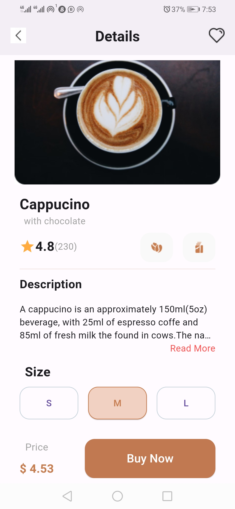
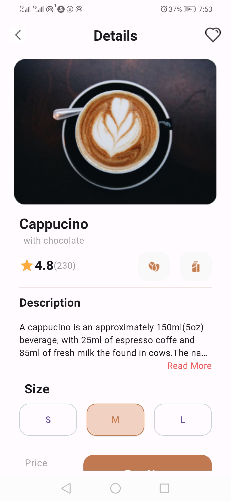

OverView: Inorder to create a clean code, I compiled my codes in different file to be returned in the main.dart file (Homepage.
).

The files where stored in the widget folder inside the Lib folder.
 Inside the widgets folder, there are:
 
 buttonsection:
The code creates a `SizedBox` widget with a specified width and height, containing an `OutlinedButton`. The button is styled with a rounded rectangular border, achieved using the `ButtonStyle` and `RoundedRectangleBorder` with a specified border radius. The button also has an outlined border with a custom color specified using `BorderSide`. The button displays the text "L" and has an `onPressed` callback function set to an empty function, indicating that no action is performed when the button is pressed.

buysection widget:
The `BuySection` widget displays a price label and a "Buy Now" button in a row layout. The price is shown in red with bold text, and the button has a custom background color and rounded corners. The button triggers an empty function when pressed. This component is designed to be compact and reusable within a larger UI layout, such as a shopping interface.

cappsection widget:
The `CappSection` widget displays information about a cappuccino product, including its name, description, rating, and ingredients. It is contained within a fixed-size container with a border at the bottom. The name and description are styled with bold and grey text, respectively. The rating is represented by stars and numerical value, followed by the number of reviews. Additionally, icons representing coffee beans and milk are displayed. This component serves as a compact representation of a product within a larger UI, such as a menu or product catalog.

description widget:
The `DescriptSection` widget presents a brief description of a cappuccino beverage within a fixed-size container. It includes the description text, limited to three lines with ellipsis for overflow, and an option to read more. The section title "Description" is displayed in bold text. The widget offers users the ability to expand the description by tapping on the "Read More" text. This component provides concise information about the product, enhancing user understanding within a UI layout.

imagesection:
The `ImageSection` widget is a stateless widget in Flutter that displays an image. It takes a required parameter `image`, which is the path to the image asset. The `build` method returns an `Image.asset` widget that loads and displays the image specified by the `image` parameter. This component serves as a reusable abstraction for displaying images within Flutter applications.

Dependencies:
- The images used are in the assets folder
- the project was emulated and tested on an andriod (Huawei Y8s) phone